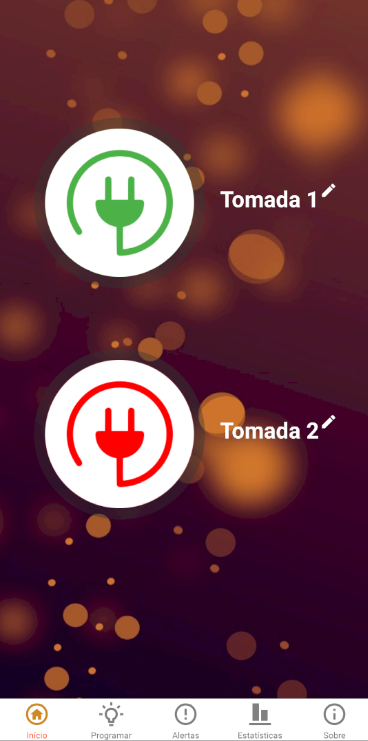

# Smart-Outlet

A Smart-Outlet é uma tomada inteligente composta pelo componente de hardware, isto é, um plug para ser conectado a rede elétrica e o componente de software, um aplicativo mobile utilizado para gerenciar o estado das tomadas. O uso da Smart-Outlet se baseia no contexto de automação residencial, buscando proporcionar uma praticidade no uso e gerenciamento dos aparelhos eletrônicos utilizados na residência. Para tanto este produto oferece os seguintes recursos: (i) Controle do estado das tomadas remotamente; (ii) Estatísticas de consumo de energia dos aparelhos e (iii) Mecanismos de agendamento e alertas para controle/mudanças de estado das tomadas.

## Sobre o projeto

O desenvolvimento deste projeto foi dividido em duas etapas, projeto de hardware e projeto de Software.

### Projeto de Hardware

Para o desenvolvimento do componente de hardware deste projeto foram utilizados os seguintes componentes

* Arduino Uno R3;
* Módulo Relay 2 canais;
* Módulo Bluetooth HC06;
* LED RGB 5mm
* Resistores de 220 Ohms;
* Protoboard;
* Jumpers;
* Fonte 9V para arduino;
* Plug tomada fêmea tripolar;
* Plug tomada macho tripolar;
 
 A conexão dos componentes foi realizada com base na figura abaixo:
 
 
 
 A finalização do componente de hardware pode ser visto na figura abaixo:
 
 
 
 ### Projeto de Software
 
 Para o controle da tomada foi desenvolvido um aplicativo mobile, utilizando a biblioteca React Native. As imagens protótipo do aplicativo pode ser visualizada abaixo:
  
 
 
 
 
 
 
 
 
 
